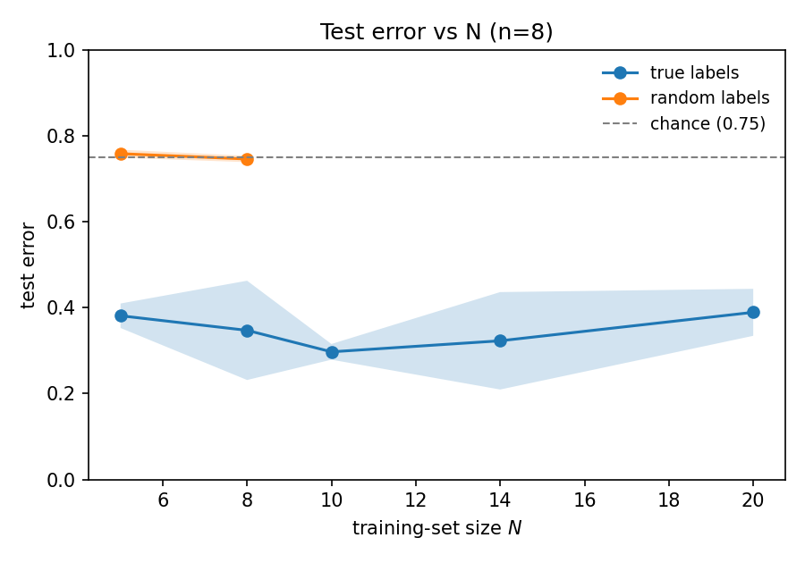

# Rethinking Generalization in QML — Replication

A public, reproducible replication of:

> **Understanding quantum machine learning also requires rethinking generalization**
> Elies Gil-Fuster, Jens Eisert, Carlos Bravo-Prieto — *Nature Communications* **15**, 2277 (2024).
> [arXiv:2306.13461](https://arxiv.org/abs/2306.13461) · authors' code: [bpcarlos/understanding_QML_rethinking_gen](https://github.com/bpcarlos/understanding_QML_rethinking_gen) (Zenodo [10.5281/zenodo.10277124](https://doi.org/10.5281/zenodo.10277124))

> **Status: end-to-end working on n=8.** All modules implemented and tested (81 tests).
> A bounded n=8 demo reproduces the paper's headline contrast — see **Results** below.
> n=16 (dense ED works but is slow on CPU) and n=32 (needs DMRG/MPS) are implemented-or-
> documented but not run on this hardware; see **Compute notes**.

## The result being replicated

A quantum convolutional neural network (QCNN) can **perfectly fit random labels and random
quantum states** while still generalizing well on the true task — so uniform-convergence
complexity measures fail to explain QML generalization, mirroring Zhang et al.'s classical
finding. Reproduced via **Fig. 3**: (a) random labels, (b) partial label corruption,
(c) random states — each reporting the empirical generalization gap vs. training-set size `N`.

## Results (this hardware: Intel i5-14400, n=8 demo)

A bounded n=8 sweep (`configs/real_labels_n8.yaml`, `configs/random_labels_n8_demo.yaml`)
reproduces the paper's central contrast. Generated with `scripts/make_figures.py`.



| | true labels | random labels |
|---|---|---|
| **test error** | **0.3–0.4** (below chance, decreasing with N) | **~0.75** (chance) |
| memorizes (train_err→0)? | yes (N≤10 within budget) | yes — e.g. N=5,seed0: `train_err=0.0, test_err=0.762`, **gap=0.76** |
| generalization gap | small / decreasing | **maximal (~0.75)** when fully memorized |

This is the paper's point: the QCNN **fits random labels yet has a maximal generalization
gap** (random test error ≈ chance), while on the **true task it generalizes** (low test
error). The robust panel is *test error vs N* (well-defined regardless of memorization).
`figures/fig3a_gap_vs_N.png` plots the gap directly, but **underestimates the random-label
gap**: most random jobs did not reach `train_err=0` within the per-job CPU time cap, which
shrinks `|train−err − test−err|`; the one fully-memorized random seed shows the true ≈0.76.

### Compute notes / honest limitations
- **CMA-ES memorization is the bottleneck**, not parallelism. Real labels memorize in
  ~15 s (N=5) to a few min; random labels are much harder (N=5 ~1–9 min depending on seed,
  N≥8 often exceeds a 9-min cap on one CPU). The authors ran CMA-ES with no iteration cap and
  unbounded restarts (more compute). To memorize random labels we enable the authors' optional
  **incorrect-class-equalizing loss term** (`equalize_loss`, in their code but commented out)
  and **IPOP** (population grows per restart) + an **in-run early stop** at 100% train acc.
- This demo is **n=8 only, reduced N grid and seeds**, to fit a ~2 h CPU budget. The full
  grids (N up to 20, 5 seeds, n=16) are in the configs but need more compute / overnight runs.

## Task & model (exact spec, extracted from the authors' code)

**Hamiltonian** (generalized cluster model, Eq. 3), couplings `j1, j2 ~ Uniform[-4, 4]^2`:

```
H = Σ_j ( Z_j − j1·X_j X_{j+1} − j2·X_{j−1} Z_j X_{j+1} )
```

Ground states (ED for n≤12; DMRG/MPS χ=40 for n=16,32) are classified into 4
symmetry-protected phases: **0 = SPT, 1 = ferromagnetic, 2 = antiferromagnetic, 3 = trivial**
(Verresen–Moessner–Pollmann, PRB 96, 165124).

**QCNN** (translation-invariant, parameter-shared; verified against `main_code.py`):

| Component | Params | Definition |
|---|---|---|
| `conv(q1,q2)` | 13 | `R(q1)·R(q2)·exp(iθ·ZZ)(q1,q2)·R(q1)·R(q2)` |
| `pool(q1,q2)` | 3 | controlled-`R(q1→q2)` (coherent — **no mid-circuit measurement**) |

Depth = log₂(n) conv layers + (log₂(n)−1) pools → **n=8: 45 params, n=16: 61, n=32: 77**.
Maps n qubits → 2 output qubits (last two indices, e.g. (3,7) for n=8, (15,31) for n=32).

**Prediction (Eq. 4):** measure the 2 output qubits; predict the **lowest-probability**
bitstring `ŷ = argmin_b p_b`. Probabilities are reconstructed from
`⟨Z_a⟩, ⟨Z_b⟩, ⟨Z_aZ_b⟩`.

**Loss (Eq. 5, minimized):** `ℓ = ⟨y| C_θ[|ψ⟩⟨ψ|] |y⟩ = p_{true-label}`, averaged over the
training set. (Not cross-entropy.)

**Optimizer:** CMA-ES (`cma.fmin2`), `sigma0 = 0.7`, `tolfun = 5e-4` (labels) / `1e-4`
(random states), params initialized `~ Uniform[0, 2π]`, gradient-free. The training loop
**restarts CMA-ES until training accuracy = 100%** (this memorization step is central to
the generalization-gap result).

## Implementation choices (this repo)

- **Circuits:** PennyLane — `lightning.qubit` (dense) for n≤16, `default.tensor` (quimb MPS,
  `qml.MPSPrep`) for n=32. The authors used TensorCircuit/Qibo; we port their **exact** gate
  decomposition (TensorCircuit `r`/`exp1`/`cr` conventions cross-checked in `src/qcnn.py`).
- **Labels:** the authors' published `(j1, j2) → label` files are adopted **verbatim** as the
  canonical dataset (their labeling function is not released and is not reconstructable from
  the paper to better than ~62%). Ground states are regenerated from those couplings.
- **Compute:** designed for an Intel i5-14400 (16 threads). A process-level job-runner
  dispatches `(experiment, n, N, seed)` configs across cores with per-job logs and
  per-worker BLAS pinning (`OMP/MKL/OPENBLAS_NUM_THREADS=1`). CMA-ES + RNG state is
  checkpointed for auto-resume (12 h Kaggle sessions, interruptions).

## Setup

### Docker (primary, one-command reproducible)

```bash
docker compose build
python scripts/fetch_authors_data.py            # one-time: pull canonical labels/couplings
docker compose run --rm experiment --config configs/random_labels_n8.yaml
```

### venv / conda (alternative)

```bash
python -m venv .venv && . .venv/bin/activate     # Windows: .venv\Scripts\activate
pip install -r requirements.txt && pip install -e .
python scripts/fetch_authors_data.py
python run_experiment.py --config configs/random_labels_n8.yaml
```

> **Windows note:** Docker Desktop runs on WSL2, which gives the Linux quimb/DMRG behaviour
> for free — recommended for the n=16/32 runs. Native-Windows venv is fine for n≤12 dev.

## Build order (validation-first)

0. **Scaffold** — packaging, Docker, data fetcher. *(done)*
1. **`phases.py`** — load & validate the authors' canonical labels (+ optional, clearly-flagged
   approximate analytic map for new points).
2. **`hamiltonian.py`** — build `H(j1,j2)`; ED ground states (n≤12); sanity-check energy/gap.
3. **`data_generation.py`** — ED + quimb-DMRG(χ=40) states from canonical couplings; cache to
   `data/`; validate observables against the authors' shipped states.
4. **`qcnn.py` + `loss.py`** — port the exact gate decomposition; assert output shape & the
   `argmin`/`p_{true}` rule on hand cases.
5. **`training.py`** — CMA-ES + checkpoint/resume + restart-until-memorized; overfit a tiny N.
6. **`randomization.py`** — random labels / partial corruption / Gaussian random states.
7. **`runner.py` + `job_runner.py`** — single-config entry + parallel dispatch + benchmark;
   reproduce an n=8 slice of Fig 3a, then estimate full-sweep wall-clock.
8. **Scale** — n=16/32 (MPS) random-label experiment.
9. **Figures + results** — Fig 3 a/b/c with std-dev shading and the 0.75 max-gap line; this
   repo's results vs the paper's, side by side.

## Open items / ZENODO-CHECK

| Item | Status |
|---|---|
| Phase-label boundary function | **Not released**; paper ~62% reconstructable → using authors' label files verbatim. |
| Boundary conditions of the Hamiltonian | **Not stated in paper.** Determined empirically: their states are reproduced by **open BC** (DMRG convention) with the literal Eq-3 Pauli structure — confirmed by a brute-force convention search + per-point cross-check (`tests/test_hamiltonian.py`). Pipeline defaults to OBC. |
| TensorCircuit `r`/`exp1`/`cr` exact unitaries | **Resolved.** Extracted numerically (`scripts/extract_tc_gates.py`) and ported exactly: `r(θ,α,φ)=exp(-iθ n·σ)`, `exp1[ZZ]=IsingZZ(2θ)`, `cr=block_diag(I,r)`. Verified in `tests/test_qcnn.py`. |
| Degenerate ground-state representatives | At FM/AFM points the ground state is non-unique; our ED representative differs from the authors' DMRG one. Irrelevant to the phenomenon (we train on our own self-consistent states) but caps the BEST_PARAMS transfer check at ~85%. |
| Randomization protocols (shuffle / corruption / Gaussian resample) | **Resolved & verified.** Random labels = i.i.d. Uniform{0..3}; corruption reassigns exactly `c` labels to a *different* class (matches `LABELS_{N}_c`); random states = i.i.d. `N(μ_ψ,σ_ψ)` on real amplitudes + renormalize (matches authors' real, unit-norm, uncorrelated inputs). See `tests/test_randomization.py`. |
| Qibo random-states conv layer applies both `U3`s to q1 only (likely a bug) | Flagged; we use the TensorCircuit conv layer as canonical. |

## License

Code: MIT (this replication). Authors' data fetched by `scripts/fetch_authors_data.py` is
CC-BY-4.0 (see their Zenodo record).
